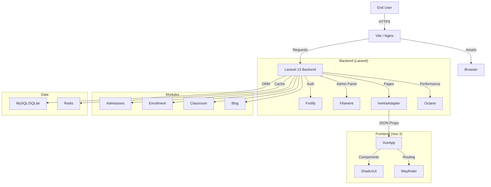
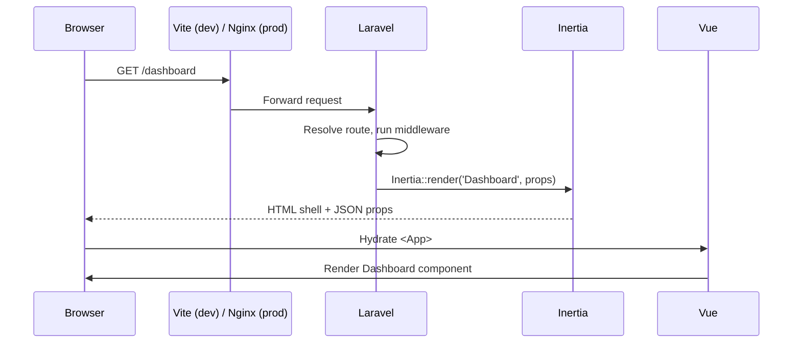

KoAkademyV2 follows a **monolithic** architecture that leverages the best of server-side stability and client-side interactivity.

## High-Level Design

## Main Application Areas

### 1. User Application (Inertia + Vue 3)

- Handles the primary user interface.
- Renders pages via Inertia.js, avoiding the complexity of a separate API.
- Uses **Reka UI** (a Vue port of Radix UI) plus Tailwind v4 for accessible, themeable components.

### 2. Admin Panel (Filament v5)

- Handles back-office operations: user management, content administration, settings.
- Built on Livewire — completely separate from the Vue frontend but sharing the same database and auth system.
- Protected by **Filament Shield** (role/permission generator) and a dedicated **AdminPanelProvider**.

### 3. Authentication & Security (Fortify + Spatie)

- **Fortify** handles headless authentication logic: login, registration, 2FA, passkeys, profile updates, password resets.
- **Spatie Laravel Permission** manages Roles and Permissions.
- **Laravel Impersonate** allows admins to "log in as" a user for support and debugging.

### 4. Modules (`nwidart/laravel-modules`)

The four first-party modules are first-class packages inside `Modules/`. They are autoloaded via Composer's `classmap`, registered as service providers, and enabled through `modules_statuses.json`.

See [Module System](/architecture/modules/) for the full module map.

## Request Lifecycle

## Why Monolithic?

- **Single deployable** — one `docker run` ships the web server, workers, and scheduler.
- **Shared domain model** — modules, app, and Filament panel all live in the same Eloquent ecosystem.
- **Type-safety end-to-end** — Wayfinder closes the loop between Laravel routes and Vue components.
