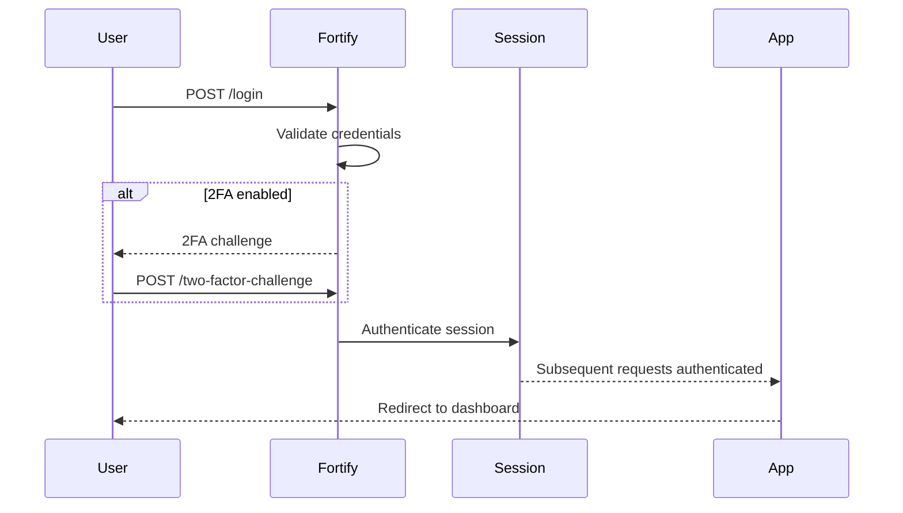
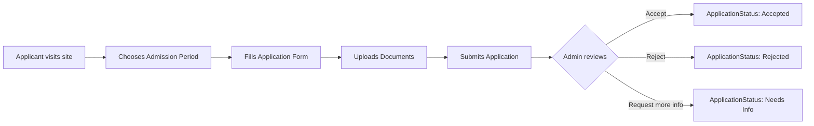
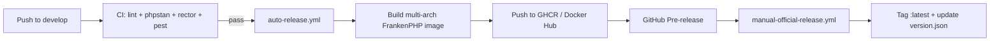

## Development Loop

The project uses `concurrently` (via `composer run dev`) to manage the dev stack:

1. **Laravel Server** — Serves the backend and API.
2. **Vite** — Hot Module Replacement (HMR) for Vue components.
3. **Queue Worker** — Processes background jobs (emails, notifications, media conversions).
4. **Pail** — Streams application logs to your terminal.

## Authentication Flow (Fortify)

1. **Login** — Request to `/login` → Fortify Action → Authenticate Session.
2. **2FA** — If enabled, Fortify interrupts the flow → user enters OTP → session fully authenticated.
3. **Passkeys** — Optional WebAuthn-based passwordless login via `robertboes/filament-passkeys`.
4. **Redirect** — User is sent to `RouteServiceProvider::HOME` (usually `/dashboard`).

## Admissions Workflow

Each transition is recorded in `application_status_histories` (see `Modules/Admissions/app/Models/ApplicationStatusHistory.php`).

## Deployment Workflow

See [CI/CD & Containers](/guides/ci-cd/) for the full pipeline reference.
