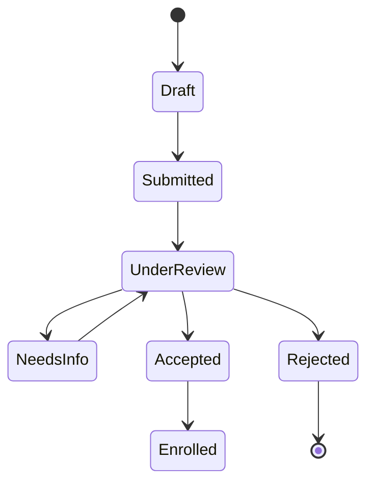

The **Admissions** module powers the public-facing application flow: prospective students pick an admission period, fill out a dynamic form, upload supporting documents, and track their application's progress. Admins review and triage applications in the Filament panel.

## Domain Models

| Model                      | Purpose                                                                 |
| :------------------------- | :---------------------------------------------------------------------- |
| `AdmissionPeriod`          | A window during which applications are accepted (open/close dates, capacity). |
| `ApplicationForm`          | The form definition for a given period — fields, validation, file inputs. |
| `Application`              | A single submission by an applicant for a specific period.              |
| `ApplicationDocument`      | An uploaded file (transcript, ID, recommendation) attached to an application. |
| `ApplicationStatusHistory` | Append-only audit log of status transitions for an application.         |

## Concepts

### Application Periods

An `AdmissionPeriod` defines *when* applications are accepted and *how many* applicants will be admitted. Only one period is `active` at a time on the public form.

### Dynamic Forms

`ApplicationForm` is a schema-driven form: admins can add, remove, and reorder fields (text, select, file, date) without code changes. The Vue form renderer reads the schema at runtime and posts back a validated payload.

### Status Workflow

Each `Application` has a status that flows through:



Every transition is recorded in `ApplicationStatusHistory`, along with the actor and an optional note.

### Documents

`ApplicationDocument` stores file references (path, mime, size, label). Files are stored on the configured disk (`local` in dev, `s3` recommended in production) and validated for type and size at upload time.

## Filament Resources

The module exposes Filament resources for admins under the **Admissions** navigation group:

- `AdmissionPeriodResource` — CRUD for periods.
- `ApplicationResource` — review queue, status transitions, document viewer.
- `ApplicationFormResource` — drag-and-drop form builder.

These are registered via `Modules\Admissions\AdmissionsPlugin`.

## Public Routes

When enabled, the module registers the following public routes (see `Modules/Admissions/routes/web.php`):

- `GET /apply` — landing page listing open periods.
- `GET /apply/{period}` — render the dynamic form for a period.
- `POST /apply/{period}` — submit an application.
- `GET /applications/{application}/status` — applicant-facing status page (token-protected).

## Events

The module dispatches events you can listen to (e.g. to send emails or push to a CRM):

- `ApplicationSubmitted`
- `ApplicationStatusChanged`

Register listeners in a service provider or in `EventServiceProvider` of the module.

## Testing

Run the module's Pest suite:

```bash
php artisan test Modules/Admissions/tests
```

Typical cases to cover when extending:

- A form field of type `file` rejects oversize uploads.
- Submitting an application outside an open period is forbidden.
- A status transition is rejected if not allowed by the policy.
- A `ApplicationStatusHistory` row is created on every transition.
