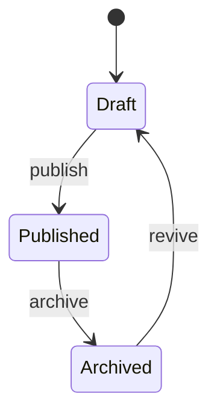

The **Blog** module is a lightweight CMS for public-facing articles: news, announcements, guides, and longer-form content tied to the platform.

## Domain Models

| Model  | Purpose                                                  |
| :----- | :------------------------------------------------------- |
| `Post` | A single article: title, slug, body, status, author.     |

The module is intentionally minimal — extend it with `Category`, `Tag`, and `Comment` models as needed.

## Concepts

### Posts

A `Post` is a publishable article with:

- `title` and `slug` (auto-generated from title via `Str::slug`).
- `body` (Markdown or HTML — pick your convention in the Filament editor).
- `excerpt` and optional `featured_image`.
- `status` (`draft`, `published`, `archived`).
- `published_at` timestamp.
- `author_id` referencing a `User`.

### Status Lifecycle



### Authoring

Authors use the Filament `PostResource` to write and publish. The public site consumes a JSON / Inertia endpoint.

## Filament Resources

- `PostResource` — full CRUD, rich editor, scheduled publishing.

Registered via `Modules\Blog\BlogPlugin`.

## Public Routes

When enabled, the module registers:

- `GET /blog` — paginated index of published posts.
- `GET /blog/{slug}` — single post page.
- `GET /blog/feed.rss` — RSS feed (if implemented).

## Extending the Module

### Add Categories

```bash
php artisan module:make-model Category Blog
```

Then add a `category_id` foreign key to `Post` and a Filament `Select` to the form.

### Add Tags

Use [`spatie/laravel-tags`](https://spatie.be/docs/laravel-tags) — already widely used in the Laravel ecosystem.

### Add Comments

Use [`spatie/laravel-comments`](https://github.com/spatie/laravel-comments) or wire up a simple `Comment` model with a Filament moderation resource.

## Events

- `PostPublished`
- `PostArchived`

## Testing

```bash
php artisan test Modules/Blog/tests
```

Cover at minimum:

- A non-published post is hidden from public routes.
- The slug is unique and auto-regenerated on title change.
- The RSS feed contains only published posts.
