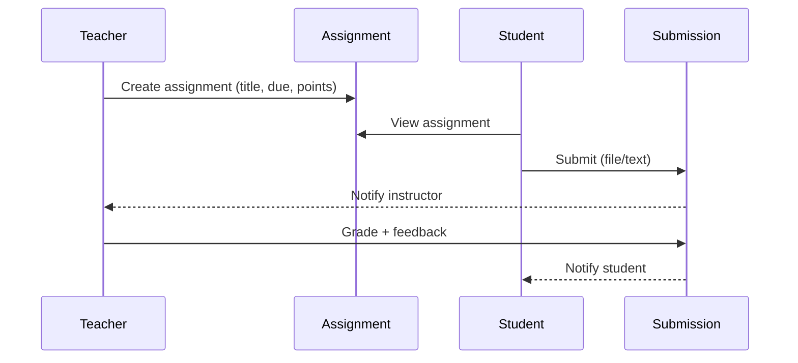

The **Classroom** module is the day-to-day teaching surface: instructors run class meetings, post announcements, give assignments, and grade submissions. Students see their schedule, submit work, and receive feedback.

## Domain Models

| Model                | Purpose                                                              |
| :------------------- | :------------------------------------------------------------------- |
| `ClassOffering`      | A scheduled instance of a subject (links to an `EnrollmentSubject`). |
| `ClassMember`        | The roster — students and instructors attached to a `ClassOffering`. |
| `ClassMeeting`       | A specific meeting/lecture of a class (date, topic, recording URL).  |
| `ClassPost`          | An announcement or post on the class feed.                           |
| `Assignment`         | A task given to students in a class (instructions, due date, points). |
| `Submission`         | A student's submission for an assignment (file, text, status, grade). |

## Concepts

### Class Offerings

A `ClassOffering` is a concrete, scheduled instance of a subject for a period (e.g. "CS101 Section A — Mon/Wed 10:00 AM"). It is the parent for meetings, members, posts, and assignments.

### Members & Roles

`ClassMember` joins a `User` to a `ClassOffering` with a role (`instructor`, `teaching_assistant`, `student`). Policies gate access to class-scoped resources based on this role.

### Meetings

`ClassMeeting` records each scheduled session: topic, notes, optional recording/video URL. They appear in the class timeline and feed.

### Class Feed

`ClassPost` is an announcement with a body and optional attachments. Posts can be pinned or restricted to specific member roles.

### Assignments & Submissions



- **`Assignment`** carries instructions, allowed file types, max points, due date, late policy.
- **`Submission`** is the student's attempt: one-to-one with a `User` + `Assignment`, but revisioned (latest wins, history preserved).

## Filament Resources

- `ClassOfferingResource` — schedule, capacity, instructor assignment.
- `ClassMemberResource` — manage the roster.
- `ClassMeetingResource` — calendar view + bulk create.
- `AssignmentResource` — build & grade.
- `SubmissionResource` — review queue.

## Student / Teacher Pages

- `/classroom` — list of classes the user is a member of.
- `/classroom/{class}` — class feed, meetings, members.
- `/classroom/{class}/assignments` — assignment list with status.
- `/classroom/{class}/assignments/{assignment}` — instructions + submit form.
- `/classroom/{class}/assignments/{assignment}/submissions` — instructor grading view.

## Events

- `AssignmentCreated`
- `SubmissionReceived`
- `SubmissionGraded`

## Testing

```bash
php artisan test Modules/Classroom/tests
```

Cover at minimum:

- Only members of a class can see its posts/meetings.
- A student can only submit to assignments belonging to classes they're enrolled in.
- A late submission is flagged based on the assignment's late policy.
- A grade write triggers a `SubmissionGraded` event.
