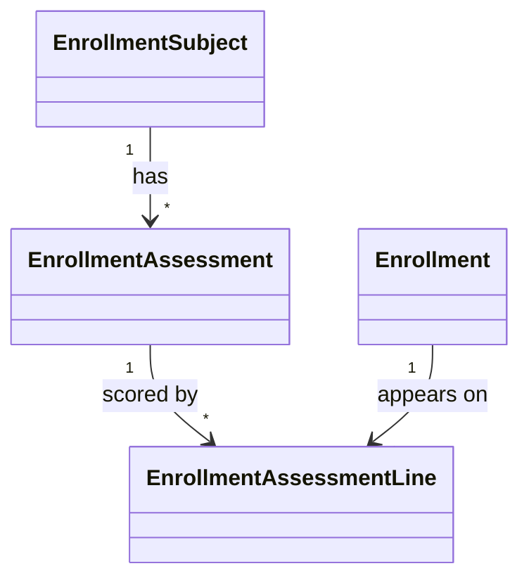

The **Enrollment** module manages the academic registration of admitted students into cohorts, subjects, and assessments.

## Domain Models

| Model                          | Purpose                                                       |
| :----------------------------- | :------------------------------------------------------------ |
| `EnrollmentPeriod`             | A registration window for a term / semester.                  |
| `Enrollment`                   | A student's registration in a period.                         |
| `EnrollmentSubject`            | A subject offered within a period (code, units, schedule).    |
| `EnrollmentAssessment`         | A graded assessment (quiz, exam, project) for a subject.      |
| `EnrollmentAssessmentLine`     | An individual student's score on a single assessment.         |

## Concepts

### Enrollment Periods

Each `EnrollmentPeriod` represents a term (e.g. "Fall 2025") with:

- An open/close date for self-service enrollment.
- A list of `EnrollmentSubject`s available.
- Capacity constraints per subject.

### Enrollments

`Enrollment` is the join between a `User` (student) and an `EnrollmentPeriod`. It carries the student's status (`enrolled`, `dropped`, `completed`, `withdrawn`) and timestamps.

### Subjects

`EnrollmentSubject` is a course offering inside a period. It has its own schedule, instructor, and assessment plan.

### Assessments & Lines



- `EnrollmentAssessment` — the assessment itself (title, type, max score, due date, weight).
- `EnrollmentAssessmentLine` — a single student's score on a single assessment.

This model lets you compute weighted final grades by joining lines through their assessment's `weight`.

## Filament Resources

Admins manage enrollments in the Filament panel:

- `EnrollmentPeriodResource` — create/close periods, attach subjects.
- `EnrollmentResource` — bulk-enroll students, view per-period rosters.
- `EnrollmentSubjectResource` — schedule, capacity, instructor.
- `EnrollmentAssessmentResource` — per-subject assessment builder.
- `EnrollmentAssessmentLineResource` — grade entry (often via infolist + bulk edit).

## Student-facing Pages

When the user app is in scope, the module contributes Vue pages under `resources/js/pages/Enrollment/`:

- `/enroll` — list open periods.
- `/enroll/{period}/subjects` — pick subjects.
- `/enroll/{period}/subjects/{subject}` — confirm.
- `/enroll/me` — my enrollments, schedule, grades.

Wayfinder generates typed route helpers for each.

## Events

- `EnrollmentCreated`
- `EnrollmentDropped`
- `AssessmentScoreRecorded`

## Testing

```bash
php artisan test Modules/Enrollment/tests
```

Cover at minimum:

- A student cannot enroll twice in the same subject within a period.
- Enrollment outside the open window is rejected.
- The final grade computation respects per-assessment weights.
- Dropping an enrollment preserves historical `AssessmentLine` rows.
